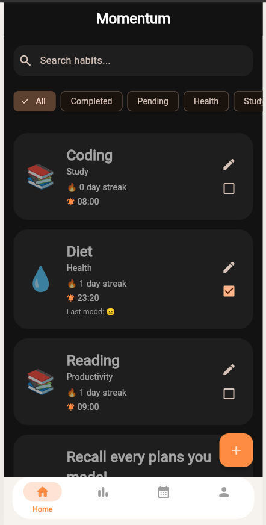
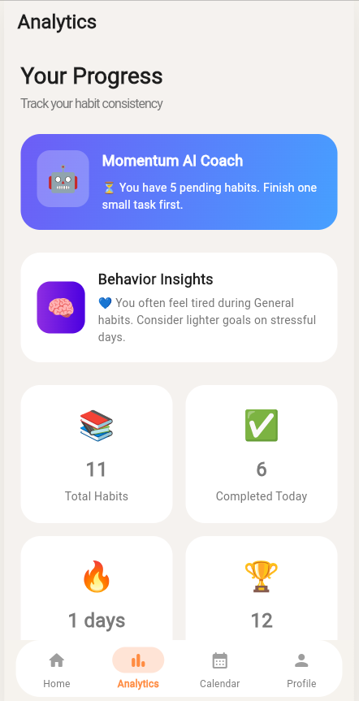
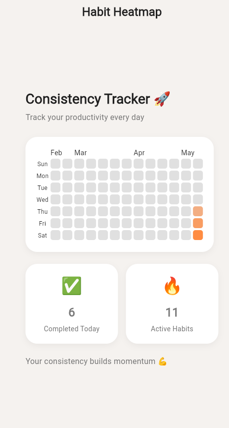
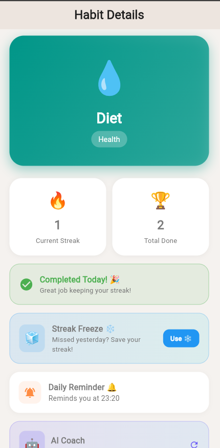
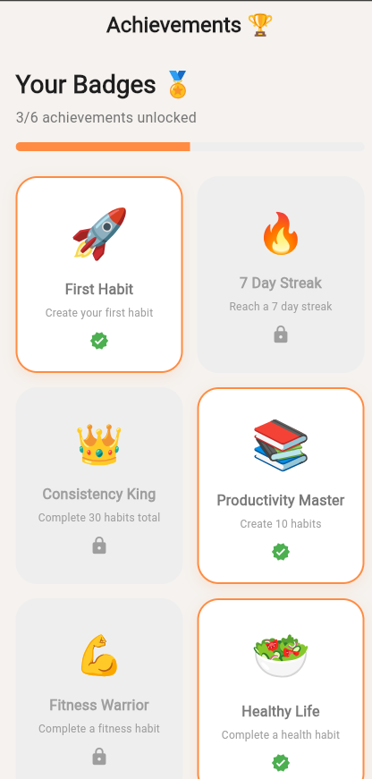
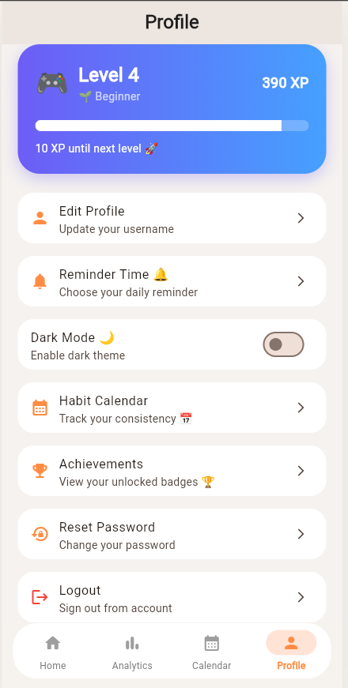

🔥 Momentum — Smart Habit Tracker

Build consistency every day.

Momentum is a full-stack productivity and habit tracking app built with Flutter and Firebase.
Unlike traditional habit trackers, Momentum combines behavioral psychology, emotional reflection, AI-powered motivation, and gamification systems to help users build sustainable long-term consistency.

Designed and developed for the Shortcut Asia Internship Challenge 2026.

🌐 Live Demo

🚀 Live Web App:
[Momentum Live Demo](https://momentum-d7cf3.web.app)

✨ Features
📌 Core Features
Feature	Description
🔐 Firebase Authentication	Secure email/password login and registration using Firebase Auth
📋 Habit Management	Create, edit, delete, and organize habits with emoji and category tags
🔥 Daily Streak System	Automatic streak tracking with daily reset logic
🔔 Smart Reminders	Per-habit reminder times with local notifications
📊 Analytics Dashboard	Real-time weekly charts, category breakdowns, completion rates
📅 Heatmap Calendar	GitHub-style consistency heatmap over time
🔎 Search & Filters	Filter habits by status and category
🌙 Dark Mode	Full light/dark theme support
🚀 Advanced Features (Beyond the Challenge Brief)
Feature	Description
🤖 AI Coach powered by Anthropic API	Context-aware motivational insights based on streaks, habits, XP, and mood
😄 Mood Reflection System	Users can log moods and reflections when completing habits
🎮 XP & Leveling	Gain XP for completed habits and level up over time
🏆 Achievement System	Unlock badges and milestones through consistency
🧊 Streak Freeze	Protect streaks during missed days
📈 Weekly Challenges	Dynamic productivity challenges with XP rewards
🧠 Behavior Insights	AI-generated productivity summaries and encouragement
👤 Profile System	Username editing, profile picture upload, password reset
📱 Mobile-First UI	Responsive iOS-inspired centered layout for desktop and mobile
🎨 Premium UI/UX	Soft-gradient onboarding, modern cards, emotional design language
🛠 Tech Stack
Layer	Technology
Framework	Flutter 3.x (Dart)
State Management	Riverpod 2.x
Backend	Firebase Firestore
Authentication	Firebase Auth
Hosting	Firebase Hosting
AI Intergration Anthropic API (Claude)
Networking http package
Notifications	flutter_local_notifications
Charts	fl_chart
Heatmap	flutter_heatmap_calendar
Animations	animate_do
🏗 Architecture
lib/
├── core/
│   ├── constants/        # Colors, spacing, theme constants
│   ├── services/         # NotificationService
│   └── theme/            # Light & dark themes
│
├── features/
│   ├── auth/             # Login, Register, AuthService
│   ├── habits/           # Habit CRUD, services, detail screens
│   ├── analytics/        # Charts, AI Coach, breakdowns
│   ├── calendar/         # Heatmap calendar
│   ├── achievements/     # Achievement system
│   ├── onboarding/       # Premium onboarding flow
│   └── profile/          # XP, levels, profile settings
│
├── shared/
│   ├── navigation/       # MainNavigation
│   └── widgets/          # Reusable UI widgets
│
└── firebase_options.dart
🔥 Firestore Database Structure
users/
  {uid}/
    username
    email
    imageBase64
    xp
    level
    streakFreeze

    habits/
      {habitId}/
        title
        emoji
        category
        completed
        streak
        completedDates[]
        reminderEnabled
        reminderTime
        mood
        reflection
🚀 Getting Started
Prerequisites
Flutter SDK 3.x
Firebase project configured
Firebase CLI installed
▶ Run Locally
git clone https://github.com/nangsan17/momentum.git
cd momentum

flutter pub get
flutter run -d chrome
🌐 Build Web Version
flutter build web
firebase deploy
📱 Run on Android
flutter run -d android
📸 Screenshots

### 🏠 Home Dashboard
Dark-mode productivity dashboard with smart filtering, streak tracking, reminders, and responsive mobile UI.

---

### 🤖 AI Productivity Insights
Anthropic-powered AI Coach with motivational feedback, behavior analysis, and productivity insights.

---

### 📅 Habit Heatmap
GitHub-style consistency heatmap visualizing long-term productivity trends and daily habit completion.

---

### 🔥 Habit Details & Streak System
Detailed habit progress view with streak freeze, reminder management, XP progression, and completion tracking.

---

### 🏆 Achievement System
Gamified badge and achievement progression system designed to encourage long-term consistency.

---

### 👤 Profile & XP Progression
User profile management with XP leveling, dark mode, achievements, and account settings.

🧠 Key Technical Decisions
Why Flutter?

Flutter allows a single codebase to run across:

Web
Android
iOS

This significantly speeds up development while maintaining a consistent UI/UX experience.

Why Firebase?

Firebase provides:

Authentication
Real-time database syncing
Hosting
Scalable backend infrastructure

Using Firebase allowed rapid iteration and deployment without building a custom backend server.

Why Riverpod?

Riverpod offers:

Better scalability
Explicit dependency management
Reactive Firestore streams
Cleaner architecture compared to basic Provider patterns
Why User-Scoped Subcollections?

Habits are stored under:

users/{uid}/habits

instead of a flat collection.

Benefits:

Better data isolation
Easier Firestore security rules
Cleaner user-specific querying
Scalable architecture
🎯 Product Thinking

Momentum was designed not only as a productivity tracker, but also as a behavioral support system.

The app focuses on: 

emotional engagement
long-term motivation
consistency psychology
positive reinforcement

Features such as:

AI coaching
mood reflections
XP systems
achievements
streak freezes

were intentionally designed to improve user retention and emotional connection with productivity habits.

🚀 Deployment

Momentum is fully deployed using Firebase Hosting:

Momentum Live App

The application is accessible on:

Desktop browsers
Android devices
iPhone/iPad browsers
📝 Future Improvements

Potential future upgrades include:

AI-generated habit recommendations
Social accountability groups
Shared productivity sessions
Native mobile APK release
Cloud Functions for smarter AI analysis
Push notification synchronization
Premium subscription model
📄 License

MIT License

❤️ Built For

Shortcut Asia Internship Challenge 2026

Built with Flutter, Firebase, and a strong focus on product thinking, behavioral UX, and modern mobile-first design.